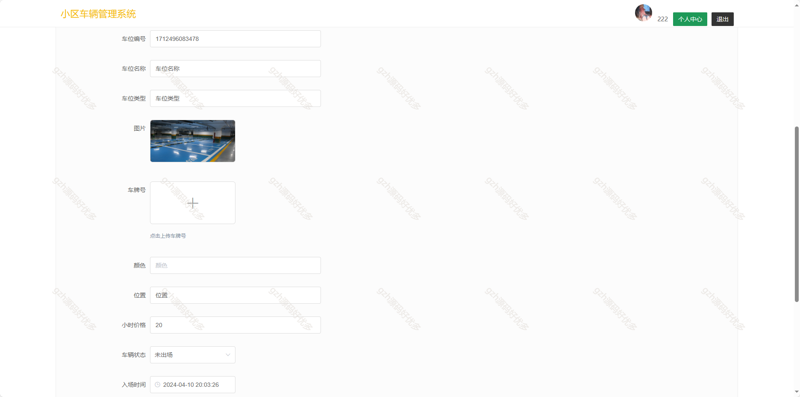
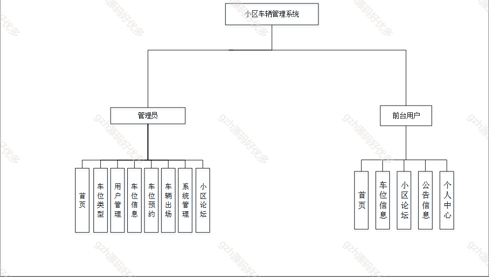
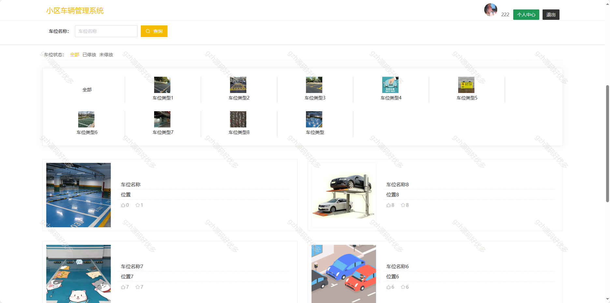
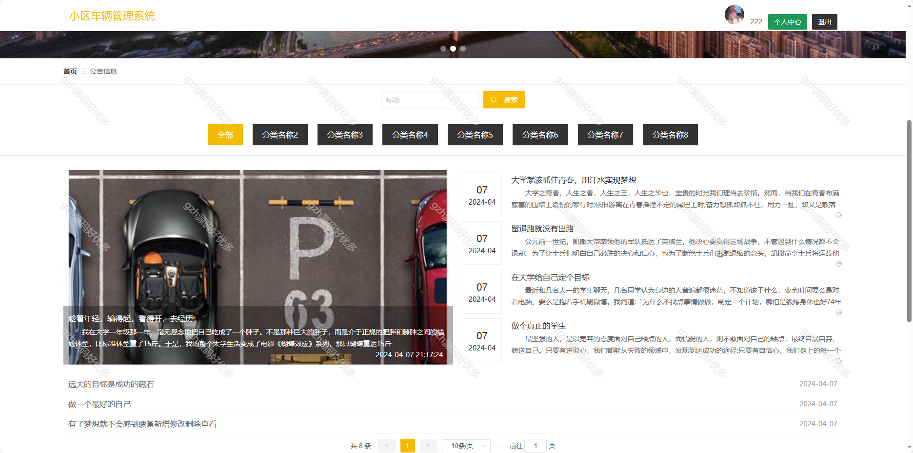
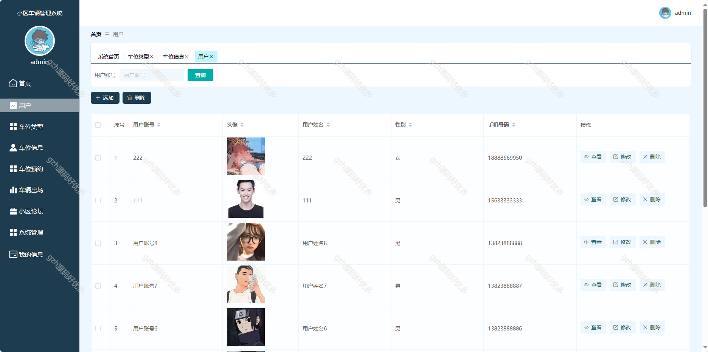
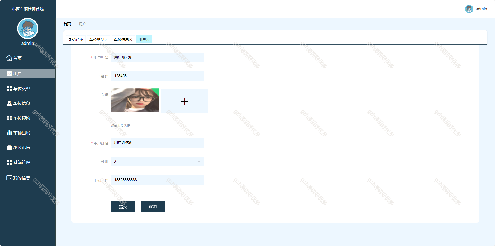
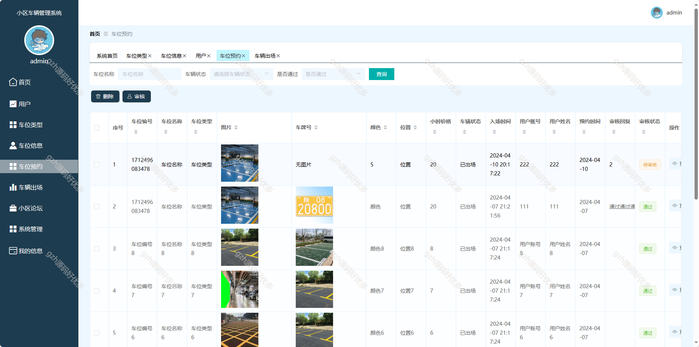
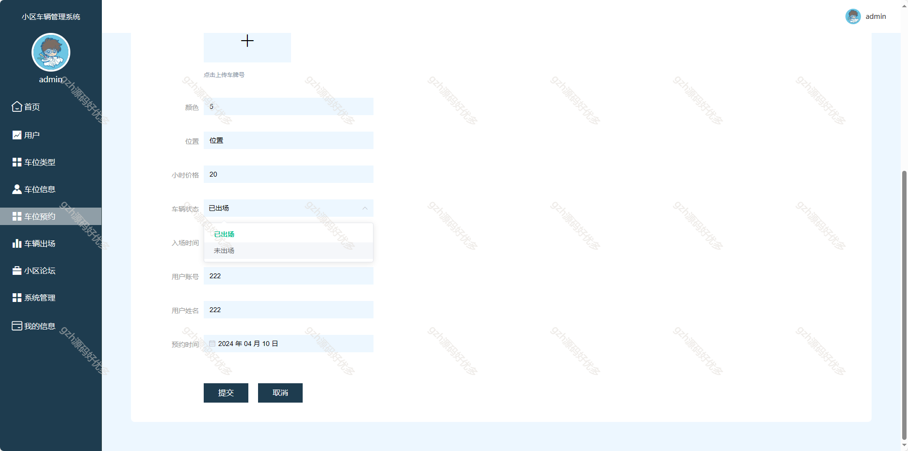
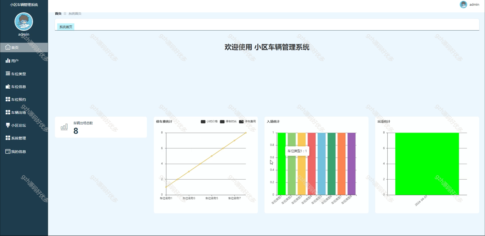
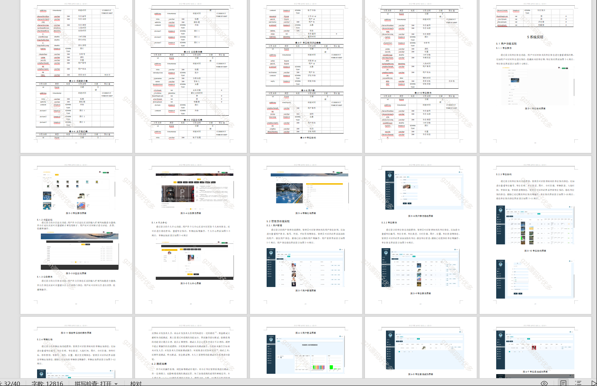

# springbootA361
springbootA361基于Java Springboot小区车辆管理系统
 
## 查看主页获取源码

### 一、作品包含

源码+数据库+设计文档万字+PPT+全套环境和工具资源+部署教程

### 二、项目技术

前端技术：Html、Css、Js、Vue2.0、Element-ui 
数据库：MySQL
后端技术：Java、SpringBoot2.0、MyBatis

  

### 三、运行环境

开发工具：IDEA/eclipse  + vscode

数据库：MySQL5.7（最低要5.7版本）

数据库管理工具：Navicat10以上版本

环境配置软件： JDK1.8 + Maven3.6.3

前端Nodejs：14

浏览器：谷歌浏览器

### 四、项目介绍
项目编号：springbootA361

旨在研究和实现一套完整的小区车辆管理系统，小区车辆管理系统有管理员和前台用户两种角色，管理员可进行首页管理、车位类型设置、用户管理等多项操作，前台用户可查看首页、车位信息等内容 

### 五、运行截图

  
